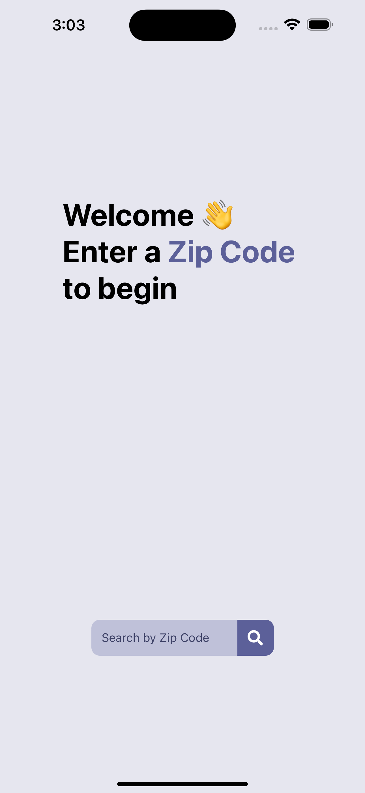
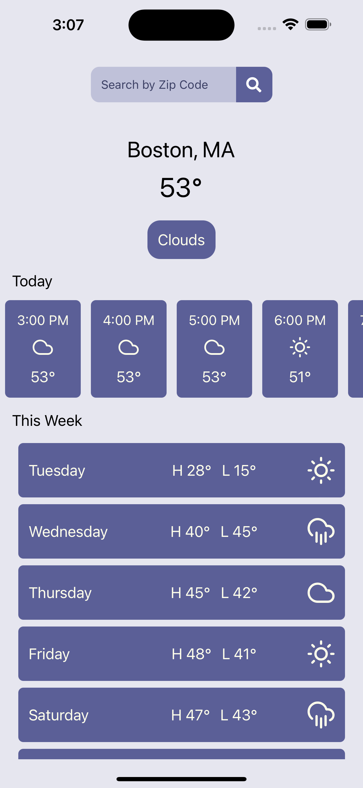
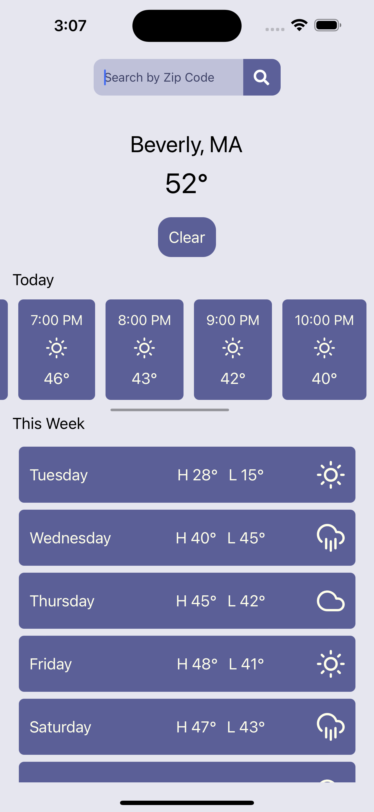

# Weather Application



## Table of Contents

- [Description](#description)
- [Features](#features)
- [Technologies Used](#technologies-used)
- [Installation](#installation)
- [Usage](#usage)
- [Additional Images](#additional-images)

## Description

This Weather Application is a mobile application built using React Native that provides users with real-time weather information based on zip code input. The application features an onboard screen that welcomes users and prompts them to enter a zip code. Upon inputting a zip code, the application fetches the corresponding coordinates and weather data from external APIs, allowing users to access accurate and up-to-date weather forecasts.

## Features

- User-friendly onboard screen with zip code input functionality.
- Integration with external APIs to fetch zip code coordinates and weather data.
- Styling using StyleSheet for consistent and visually appealing UI design.
- Utilization of utility functions for improved code organization and maintainability.
- Seamless integration with xCode for local development and testing using iOS simulator.

## Technologies Used

- React Native
- StyleSheet
- Fetch API
- xCode (for iOS simulator)
- npm (for server startup)

## Installation

1. Clone the repository:

```bash
git clone https://github.com/alexcw08/Weather-Application.git
```

2. Navigate to the project directory:

```bash
cd weather-application
```

3. Install dependencies:

```bash
npm install
```

## Usage

1. Start the server:

```bash
npm run ios
```

2. Open the application in xCode and run it using the iOS simulator.

3. Follow the on-screen instructions to input a zip code and view the weather forecast.

## Additional Images



